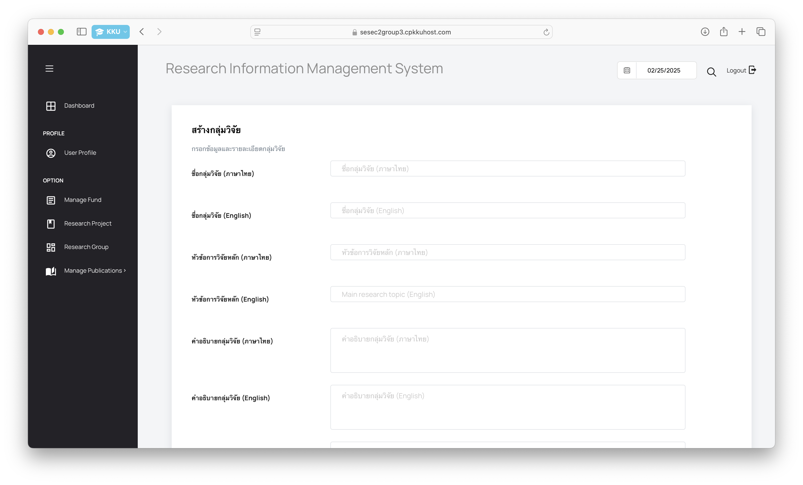

# User Manual Sprint 2

## การเข้าสู่เว็บไซต์
1. เปิดเบราว์เซอร์ของคุณ (เช่น Google Chrome, Firefox, หรือ Microsoft Edge)
2. เข้าสู่เว็บไซต์โดยพิมพ์ URL ในแถบที่อยู่:
   - **URL:** [https://sesec2group3.cpkkuhost.com]
3. เมื่อเข้าสู่หน้าแรกของเว็บไซต์แล้ว จะเห็นเมนูหลักและฟังก์ชันต่างๆ ที่สามารถใช้งานได้

## Admin

#### เข้าสู่ระบบ
1. กดที่ปุ่ม LOGIN มุมขวาบนของเว็บไซต์
2. กรอก Username และ Password ที่ได้รับ แล้วกด LOG IN

#### เพิ่มกลุ่มวิจัย
1. เลือกเมนู Research Group จาก Side Bar
2. เลือกไอคอนบวก

3. เพิ่มเนื้อหา Research Group

4. กดปุ่ม submit หากขึ้นข้อความว่า "Research group created successfully." ถือว่าเสร็จสิ้นแล้ว

#### ดูรายละเอียดกลุ่มวิจัย
1. เลือกเมนู Research Group จาก Side Bar
2. สังเกตคอลัมน์ Group name เลือกแถวที่เป็นกลุ่มวิจัยที่สนใจ
3. ในคอลัมน์ Action จะมีปุ่มให้ดำเนินการ ปุ่มรูปตา คลิกปุ่มดังกล่าวเพื่อเปิดหน้า รายละเอียดกลุ่มวิจัย โดยละเอียด

#### แก้ไขกลุ่มวิจัย
1. เลือกเมนู Research Group จาก Side Bar
2. ในคอลัมน์ Action จะมีปุ่มให้ดำเนินการ ปุ่มรูปดินสอ ให้คลิกปุ่มดังกล่าว

3. แก้ไขข้อมูล Research Group ตามช่องที่ต้องการ

4. กดปุ่ม submit หากขึ้นข้อความว่า "Research group updated successfully." ถือว่าเสร็จสิ้นแล้ว

#### ลบกลุ่มวิจัย
1. เลือกเมนู Research Group จาก Side Bar
2. สังเกตคอลัมน์ Group name เลือกแถวที่เป็นกลุ่มวิจัยที่ต้องการลบ
3. ในคอลัมน์ Action จะมีปุ่มให้ดำเนินการ ปุ่มรูปถังขยะ ให้คลิกปุ่มดังกล่าว

4. ระบบอาจแสดงหน้าต่างแจ้งเตือน หากต้องการลบจริง ให้กดปุ่ม OK เพื่อดำเนินการลบ

5. หากขึ้นข้อความว่า "Delete Successfully" ถือว่าเสร็จสิ้นแล้ว

6. กดปุ่ม OK เพื่อ refresh หน้าเว็บไซต์

## Student

#### เข้าสู่ระบบ
1. กดที่ปุ่ม LOGIN มุมขวาบนของเว็บไซต์
2. กรอก Username และ Password ที่ได้รับ แล้วกด LOG IN

#### ดูรายละเอียดกลุ่มวิจัย
1. เลือกเมนู Research Group จาก Side Bar
2. สังเกตคอลัมน์ Group name เลือกแถวที่เป็นกลุ่มวิจัยที่สนใจ
3. ในคอลัมน์ Action จะมีปุ่มให้ดำเนินการ ปุ่มรูปตา คลิกปุ่มดังกล่าวเพื่อเปิดหน้า รายละเอียดกลุ่มวิจัย โดยละเอียด

#### แก้ไขกลุ่มวิจัย (เฉพาะผู้ที่มีสิทธิแก้ไข)
1. เลือกเมนู Research Group จาก Side Bar
2. ในคอลัมน์ Action จะมีปุ่มให้ดำเนินการ ปุ่มรูปดินสอ ให้คลิกปุ่มดังกล่าว

3. แก้ไขข้อมูล Research Group ตามช่องที่ต้องการ

4. กดปุ่ม submit หากขึ้นข้อความว่า "Research group updated successfully." ถือว่าเสร็จสิ้นแล้ว

## Teacher
#### เข้าสู่ระบบ
1. กดที่ปุ่ม LOGIN มุมขวาบนของเว็บไซต์
2. กรอก Username และ Password ที่ได้รับ แล้วกด LOG IN

#### เพิ่มกลุ่มวิจัย
1. เลือกเมนู Research Group จาก Side Bar
2. เลือกไอคอนบวก

3. เพิ่มเนื้อหา Research Group

4. กดปุ่ม submit หากขึ้นข้อความว่า "Research group created successfully." ถือว่าเสร็จสิ้นแล้ว

#### ดูรายละเอียดกลุ่มวิจัย
1. เลือกเมนู Research Group จาก Side Bar
2. สังเกตคอลัมน์ Group name เลือกแถวที่เป็นกลุ่มวิจัยที่สนใจ
3. ในคอลัมน์ Action จะมีปุ่มให้ดำเนินการ ปุ่มรูปตา คลิกปุ่มดังกล่าวเพื่อเปิดหน้า รายละเอียดกลุ่มวิจัย โดยละเอียด

#### แก้ไขกลุ่มวิจัย (เฉพาะผู้ที่มีสิทธิแก้ไข)
1. เลือกเมนู Research Group จาก Side Bar
2. ในคอลัมน์ Action จะมีปุ่มให้ดำเนินการ ปุ่มรูปดินสอ ให้คลิกปุ่มดังกล่าว
3. แก้ไขข้อมูล Research Group ตามช่องที่ต้องการ

4. กดปุ่ม submit หากขึ้นข้อความว่า "Research group updated successfully." ถือว่าเสร็จสิ้นแล้ว

#### ลบกลุ่มวิจัย (เฉพาะผู้ที่เป็น head project)
1. เลือกเมนู Research Group จาก Side Bar
2. สังเกตคอลัมน์ Group name เลือกแถวที่เป็นกลุ่มวิจัยที่ต้องการลบ
3. ในคอลัมน์ Action จะมีปุ่มให้ดำเนินการ ปุ่มรูปถังขยะ ให้คลิกปุ่มดังกล่าว

4. ระบบอาจแสดงหน้าต่างแจ้งเตือน หากต้องการลบจริง ให้กดปุ่ม OK เพื่อดำเนินการลบ

5. หากขึ้นข้อความว่า "Delete Successfully" ถือว่าเสร็จสิ้นแล้ว

6. กดปุ่ม OK เพื่อ refresh หน้าเว็บไซต์

## บุคคลภายนอก

#### ค้นหากลุ่มวิจัย
1. เลือกเมนู RESEARCH GROUP จาก Navigation Bar
2. Click ที่ช่องค้นหา

3. ใส่ชื่อ Researcher Group ที่ต้องการค้นหา

#### ดูข้อมูลกลุ่มวิจัย
1. เลือกเมนู RESEARCH GROUP จาก Navigation Bar
2. เมื่อเข้าหน้า Research Group จะแสดงรายการกลุ่มวิจัยที่มีอยู่ ให้กดที่ การ์ด (Card) ของ Research Group ที่สนใจเพื่อเปิดดูรายละเอียดของกลุ่มวิจัยนั้น

